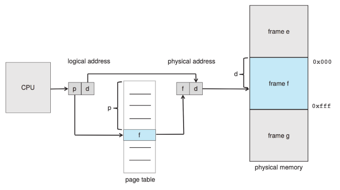

# Non-contiguous Memory Allocation

**Segmentation** proposes that the process itself be divided into 'segments'. Each segment will have its' own base and limit. No internal fragmentation, though external may remain.

In **paging** -

* Processes are divided into "pages" of equal sizes in logical memory.
* Physical memory is divided into frames, each of size of a page.
* Page table has page-frame mappings.
* Spanning i.e breaking of process is allowed so no external fragmentation. But some internal fragmentation yet remains as we divide into units of pages.

When the page table is too big, a **Translation Look Aside Buffer \(TLB\)** is a cache to speed up page hits.

